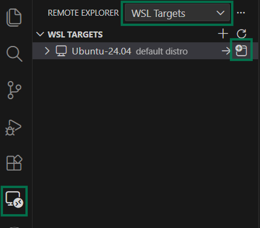
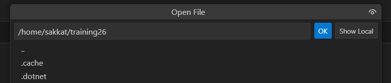

# Description

This document provides step-by-step instructions to configure a development workspace using **Windows Subsystem for Linux (WSL)** and install the necessary requirements for Node.js projects.
# Configure WSL workspace

1. Open remote explorer in VS Code and connect to WSL: `Remote-WSL: New Window`



2. A new window will open, and you can open your workspace folder in WSL: `File > Open Folder`
3. Create a workspace folder in WSL, for example: `~/training26`



Hint: You can open a wsl terminal session from Mobaxtem: Session --> WSL: Select Distro, and Specify a username.

# Install Requirements:
## 1. Install Node.JS

```bash
sudo apt update
sudo apt install -y nodejs npm
```

## 2. Install Git

```bash
sudo apt install -y git
```

Configure Git with your information:
```bash
git config --global user.name "Your Name"
git config --global user.email "your.email@example.com"
```

Verify installation:
```bash
git --version
```

## 3. Install MongoDB
### 1. Install MongoDB (official repo for Ubuntu 24.04)
```bash
wget -qO - https://pgp.mongodb.com/server-7.0.asc | sudo tee /usr/share/keyrings/mongodb-server-7.0.gpg > /dev/null

echo "deb [ signed-by=/usr/share/keyrings/mongodb-server-7.0.gpg ] https://repo.mongodb.org/apt/ubuntu $(lsb_release -cs)/mongodb-org/7.0 multiverse" | sudo tee /etc/apt/sources.list.d/mongodb-org-7.0.list

sudo apt update
sudo apt install -y mongodb-org
```
### 2. Create the data directory and set permissions
```bash
sudo mkdir -p /data/db
sudo chown $(id -u):$(id -g) /data/db
```

### 3. Start MongoDB, binding to all interfaces
```bash
sudo mongod --dbpath /data/db --bind_ip 0.0.0.0
```

### 4. Connect to Robo 3T (on Windows):
```text
In WSL, run: hostname -I and copy the IP address.
In Robo 3T, create a new connection:
Address/host: (your WSL IP)
Port: 27017
```
